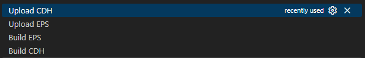

# Orion CubeSat C&DH: GSoC 2026 Proof of Concept

> **A learning and testing sandbox for the [Orion CubeSat Testbed](https://github.com/omega-space-group/orion-cubesat-testbed) Command & Data Handling (C&DH) software/hardware project.**

## Overview

This repository serves as a Proof of Concept (PoC) and experimental sandbox for my Google Summer of Code (GSoC) 2026 proposal with GFOSS. The goal of the main project is to develop robust C&DH software for an open-source CubeSat FlatSat testbed. 

Before committing to the official repository, I built this PoC to:
1. **Validate Core Prerequisites:** Demonstrate a working knowledge of FreeRTOS, STM32 microcontrollers, and inter-node CAN bus communication.
2. **Iterative Learning:** Create a testing ground to safely experiment with advanced aerospace protocols and architectural patterns required for the final project.
3. **Hardware-in-the-Loop Testing:** Verify bidirectional communication between a simulated FlatSat bus and a Ground Control station.

## Current State: Basic Flight Computer System

Currently, this project implements a **very basic**, two-node flight computer system (C&DH + EPS) running FreeRTOS, communicating over CAN, and controlled via an RF link.

```text
Ground Station (RPi)  <-- 2.4 GHz NRF24L01+ -->  C&DH Node  <-- CAN Bus -->  EPS Node
```

Ground Control & USB Debugging interface
<br> TODO: Add image

Current Hardware Wiring Overview
<br> TODO: Add image

Demo Video
<br> TODO: Add video

### Key Features
* **Gateway Architecture:** The C&DH acts as the gateway between the ground station and the satellite bus, while the EPS responds to C&DH requests and reports telemetry (e.g., internal temperature).
* **Bidirectional Link:** Ground-to-satellite command and telemetry link.
* **Hardware Control:** LED toggle commands (C&DH and EPS) from the ground station, and button press forwarding between nodes/ground.
* **Telemetry Reporting:** Periodic status reporting (LED states, EPS temperature, CAN link health).
* **Ground Station UI:** Rich terminal UI dashboard on the Raspberry Pi.
* **Debug Logging:** USB CDC debug logging with a structured format: `[NODE] TASK LEVEL: message`.

### PoC Hardware
* **Microcontrollers:** 2x STM32G431CBU6 (ARM Cortex-M4F @ 16 MHz) for C&DH and EPS nodes.
* **Internal Bus:** CAN @ 500 kbps via TJA1050 transceivers.
* **Radio Link:** NRF24L01+ 2.4 GHz ISM modules.
* **Ground Station:** Raspberry Pi.
* **AI Payload:** None.

**[Info about STM32 Config,  RTOS tasks, CAN protocol, and Radio configuration in TECHNICAL_DETAILS.md](./technical_details/TECHNICAL_DETAILS.md)**

---

## Roadmap & GSoC Objectives

This repository will evolve as I tackle the specific requirements of the Orion CubeSat Testbed. The roadmap directly aligns with my GSoC proposal objectives:

* [ ] **Hardware Upgrades:** Transition to faster, CAN Bus transceivers (ditch the current TJA1050).
* [ ] **CubeSat Space Protocol (CSP):** Upgrade the current raw CAN communication to use CSP over CAN.
* [ ] **RF Link Upgrade (SDR):** Replace the current nRF24L01+ radio modules with a Software-Defined Radio (SDR) and RF link.
* [ ] **Codebase Refactor** Start from scratch and split the C&DH and EPS codebases into different projects (ditch the same codebase workflow)
* [ ] **NASA cFS-Inspired Architecture:** Refactor the codebase to adopt a modular, bus-agnostic software architecture inspired by NASA's Core Flight System (cFS).
* [ ] **AI Payload & Eclipse Zenoh:** Implement high-performance data routing using Zenoh middleware to support AI payload.

---

## Quickstart & Build Instructions

Both nodes share the same codebase (see *Codebase Refactor in roadmap*), built with `-DNODE_TYPE=NODE_C&DH` 
<br> or `-DNODE_TYPE=NODE_EPS`.

### Prerequisites (Windows)
* [STM32CubeCLT](https://www.st.com/en/development-tools/stm32cubeclt.html)
* [dfu-util](https://dfu-util.sourceforge.net/) — for flashing firmware via USB DFU.

### Flashing (VS Code tasks are provided for one-click build and upload of both node types.)


Firmware can be uploaded using:
1.  **VS Code tasks** — Build + flash in one step via USB DFU.
2.  **STM32CubeProgrammer** — via USB DFU mode or ST-LINK.

### Running the Ground Station
Tested on a Raspberry Pi 3B with SPI enabled. (Simple command line interface built with the python rich package)
```bash
cd ground_control_scripts
pip install -r requirements.txt
python ground_station.py
```
*Controls: `z` toggle EPS LED, `x` toggle C&DH LED, `q` quit.*

---

## AI Disclosure
(All code is manually reviewed before commiting to the codebase)
AI was used to assist with:
- Research and troubleshooting
- Build system setup (CMake)
- README improvements
- NRF24L01+ radio integration and driver usage