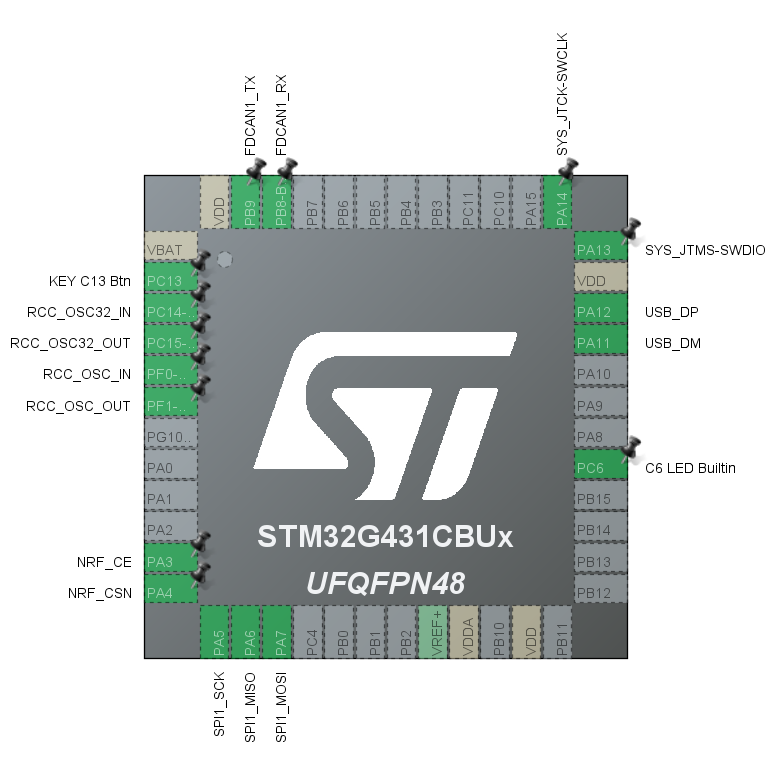
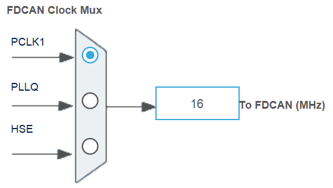

# Technical Details: Orion C&DH Proof of Concept

This document outlines STM32 config, communication protocols, and RTOS architecture used in the current PoC.

## 🎛️ STM32 Configuration (CubeMX)

The peripheral initialization, pin routing, and clock tree configuration were generated using STM32CubeMX.

### Pinout

### FDCAN BUS Clock

---

## 📡 Radio Configuration (NRF24L01+)

Currently, the RF link is simulated using 2.4 GHz NRF24L01+ modules (scheduled to be replaced by SDR in the GSoC roadmap). The current configuration is as follows:

| Parameter | Value |
| :--- | :--- |
| **Frequency** | 2476 MHz (channel 76) |
| **Data Rate** | 2 Mbps |
| **TX Power** | 0 dBm |
| **Payload Size** | 8 bytes (static) |
| **Address** | `0xE7E7E7E7E7` (5 bytes) |
| **CRC** | 1 byte |
| **Auto-ACK** | Enabled |
| **Retransmits** | 3 attempts, 250 us delay |

---

## 🚌 CAN Bus Protocol

The internal satellite bus uses raw CAN at 500 kbps (scheduled to be upgraded to CSP over CAN). The current message dictionary is defined below:

| ID | Direction | Payload | Description |
| :--- | :--- | :--- | :--- |
| `0x100` | C&DH -> EPS | 1 byte: LED state | LED command |
| `0x101` | C&DH -> EPS | 0 bytes | Status request |
| `0x200` | EPS -> C&DH | 1 byte: button/LED state | Button event |
| `0x201` | EPS -> C&DH | 2 bytes: temp (LE, x10) | Temperature telemetry |
| `0x202` | EPS -> C&DH | 1 byte: LED state | Status response |

---

## ⏱️ RTOS Architecture

The system is built on FreeRTOS. Inter-task communication uses a FreeRTOS message queue (4 slots x 8 bytes) from `canTask` to `radioTask` for outbound radio payloads. CAN RX is interrupt-driven with volatile flags consumed by tasks.

### Task Allocation

| Task | Node | Priority | Stack | Purpose |
| :--- | :--- | :--- | :--- | :--- |
| `defaultTask` | Both | Normal | 1024 B | USB CDC init, then suspends |
| `canTask` | Both | AboveNormal | 1024 B | CAN TX/RX, button polling, LED control, telemetry |
| `radioTask` | C&DH only | Normal | 1024 B | NRF24 TX/RX, ground command processing, status responses |